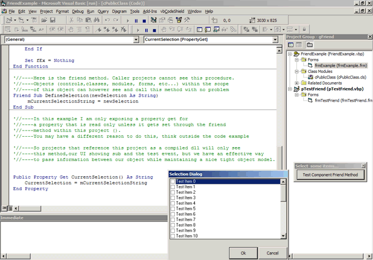



## I use my friends, do you?

### Description

This code is a simple example to illustrate using friend methods (or functions, etc...) to pass information between objects within a project (ocx,dll,etc...). The purpose of this example is to show people unfamiliar with friend procedures how they can enable you to develop components that only expose the properties/procedures you wish to make available to your target audience.
 
### More Info
 
hope you find this useful!

             |
---                |---
**Submitted On**   |2004-07-15 22:14:26
**By**             |[Ray Hildenbrand](https://github.com/Planet-Source-Code/PSCIndex/blob/master/ByAuthor/ray-hildenbrand.md)
**Level**          |Intermediate
**User Rating**    |4.7 (14 globes from 3 users)
**Compatibility**  |VB 5\.0, VB 6\.0
**Category**       |[Custom Controls/ Forms/  Menus](https://github.com/Planet-Source-Code/PSCIndex/blob/master/ByCategory/custom-controls-forms-menus__1-4.md)
**World**          |[Visual Basic](https://github.com/Planet-Source-Code/PSCIndex/blob/master/ByWorld/visual-basic.md)
**Archive File**   |[I\_use\_my\_f1770467162004\.zip](https://github.com/Planet-Source-Code/ray-hildenbrand-i-use-my-friends-do-you__1-54986/archive/master.zip)

